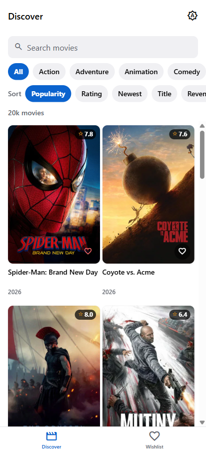
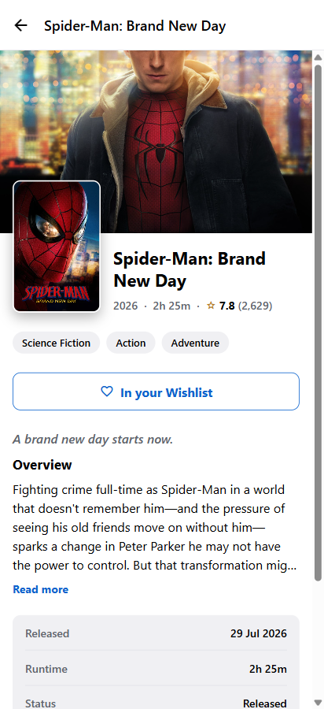
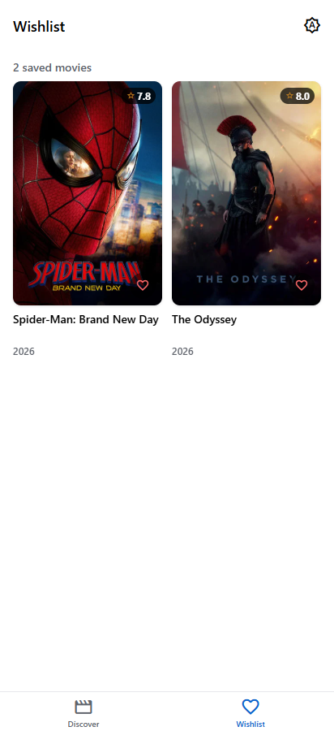
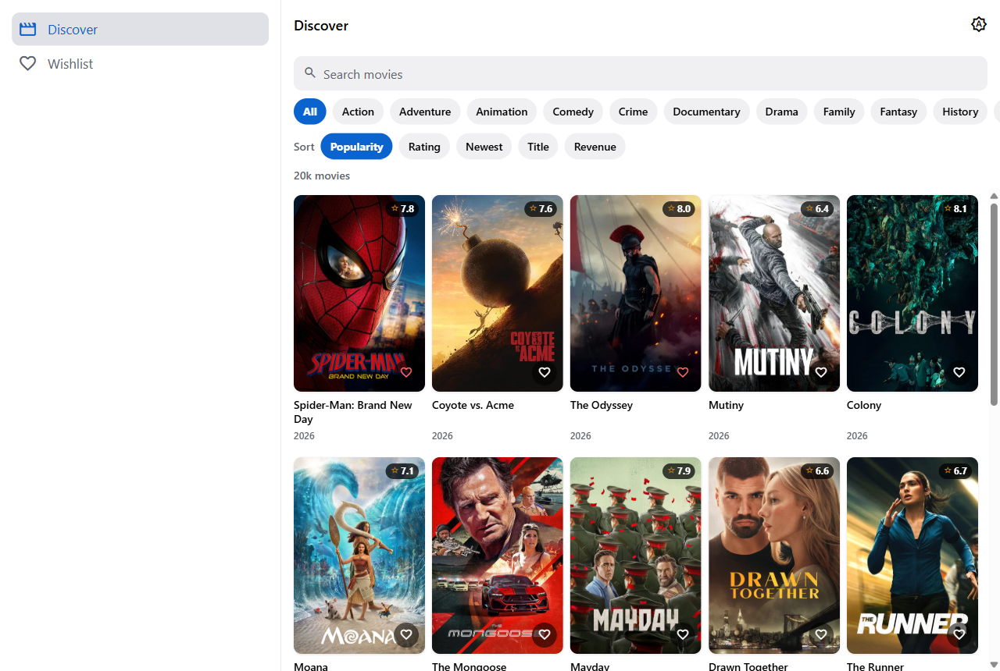

# Movie Discovery App

A movie discovery app where the client talks only to *our own* Node.js backend, which
abstracts TMDB, and where a wishlist persists across restarts — including when the
backend is down. Built as a full-stack intern take-home; graded as much on the
approach (caching, retries, circuit breaking, rate limiting, upstream-data
normalization) as on the result, so this README treats the resilience story as a
first-class deliverable, not an afterthought.

| Discover | Movie detail |
|---|---|
|  |  |

| Wishlist | Desktop / wide layout |
|---|---|
|  |  |

---

## Setup

**Fastest path for reviewing** — a hosted instance of `server/` (Render, with a
real TMDB key configured) is already running, so you can skip the TMDB signup and
`server/.env` step entirely:

```bash
npm install
cp .env.example .env
# uncomment the EXPO_PUBLIC_API_URL line pointing at the Render URL in .env.example
npm start
```

Scan the QR code with **Expo Go**. Free-tier Render spins down after ~15min idle,
so the first request may take 30-60s to wake it, and its SQLite-backed cache and
wishlist reset on every restart (no persistent disk on the free plan) — fine for
browsing, just don't expect wishlist entries to survive a cold start.

**Running the whole stack locally** (needed if you want to exercise the
resilience/fault-injection story in the table below — the hosted instance has
`ENABLE_FAULT_INJECTION` on, but you'll want your own server logs/cache visible):
Requires **Node ≥ 20.12** (tested on 24). Two `npm install`s: the Expo app at the
repo root, and the Express server in its own `server/` package with its own
`node_modules` and lockfile.

```bash
npm install
npm run server:install

cp .env.example .env                  # optional — see below
cp server/.env.example server/.env    # required
```

Open `server/.env` and set **either** `TMDB_ACCESS_TOKEN` (v4 read token) or
`TMDB_API_KEY` (v3 key) — get either free at
[themoviedb.org/settings/api](https://www.themoviedb.org/settings/api). The app
still boots and stays navigable with neither set: movie routes return a labelled
`503 UPSTREAM_MISCONFIGURED` naming the file to edit, genres fall back to a
hardcoded list, and the wishlist keeps working off its local snapshot table — an
empty grid looks like a bug, so the server says exactly what's wrong instead.

The root `.env.example` is almost never needed for local dev: the app derives the
API host from the Expo dev server's own address (`Constants.expoConfig.hostUri`),
which is what makes a physical device on Expo Go work with zero configuration.
Only set `EXPO_PUBLIC_API_URL` if the API runs somewhere else (like the hosted
instance above).

```bash
npm run dev
```

This starts both processes together (`concurrently`): the Express API on `:4000`
and `expo start` for the app. Scan the QR code with **Expo Go** — no dev build, no
`metro.config.js`, no native modules outside Expo Go.

**Testing on a physical Android device**: it must be on the same Wi-Fi/LAN as this
machine, and Windows Firewall will prompt to allow Node on first run — allow it on
the Private network profile. If the device still can't reach the API, check that
`server/.env`'s `CORS_ORIGINS` includes the origin the app is actually loaded from
(matters for web; native requests aren't subject to CORS).

**Windows note**: `localhost` tries IPv6 before IPv4 here, which makes a refused
connection (e.g. testing the "server is down" state) noticeably slower — ~11s
rather than the ~3s the retry delays alone suggest. Not a bug in this app.

Run everything separately if you'd rather see two terminals:
`npm run dev:server` (API only) and `npm start` (app only).

---

## Architecture

```
Expo app (iOS / Android / web)          Express API (:4000)              TMDB
  react-query cache                       L1 LRU  →  L2 SQLite
  URL params = filter state               inflight coalescing     ──►  /discover /search
  AsyncStorage wishlist mirror            retry · timeout · breaker     /movie/:id /genre
        │                                 token-bucket limiter
        └── fetch /api/* ────────────────► zod parse + normalize
                                          SQLite: wishlist + movie snapshots
```

Three layers of "don't ask twice": client debounce (350ms) → react-query cache →
server L1/L2 cache + in-flight coalescing. A burst of six genre-chip taps produces
**≤2** TMDB calls, measurable live in `/api/health`.

---

## API reference

| Method | Path | Notes |
|---|---|---|
| GET | `/api/health` | Uptime, breaker state, cache hit rate, upstream call count, fault-injection state, DB row counts |
| GET | `/api/genres` | 24h TTL; hardcoded 19-genre fallback if TMDB is unreachable or unconfigured |
| GET | `/api/movies` | `query?` `genres?` (`"28,35"`, ≤5) `sort?` `page?` (1–500) `minRating?` `year?`. Browse and search share this one endpoint — `query`'s presence flips `meta.mode` |
| GET | `/api/movies/:id` | Movie detail, with genre names resolved |
| GET | `/api/wishlist` · `/ids` | Requires `x-device-id` header. `/ids` returns a bare `number[]` for cheap heart-state sync |
| POST | `/api/wishlist` | `{movieId, movie?}` — idempotent (200 on repeat, 201 on first add) |
| DELETE | `/api/wishlist/:movieId` | `204`, idempotent whether or not the row existed |
| POST | `/api/wishlist/sync` | `{ops: [...]}` — offline-queue flush endpoint, last-write-wins by timestamp. **Implemented and tested server-side; the client does not yet queue offline writes** — see Known limitations |
| POST | `/api/debug/fault` · `/cache/clear` · `/breaker` | **404 unless `ENABLE_FAULT_INJECTION=1`.** Curl-driven, reviewer-facing only — there's no in-app screen for backend health, since end users don't care |

Every response carries a `meta` object — `source` (`live`/`cache`/`stale-cache`),
`degraded`, `upstreamStatus`, `droppedItems`, `requestId` — which is the app's
honesty channel: the UI explains itself from server-reported facts, never from
client-side guessing.

---

## Key technical decisions

| Decision | One-line trade-off |
|---|---|
| Separate Express service, not Expo Router API routes | More moving parts to run locally, but keeps the resilience layer (breaker, limiter, cache) a normal long-lived Node process rather than working around a serverless request lifecycle |
| SQLite (Drizzle) as wishlist source of truth, mirrored to AsyncStorage | A typed `schema.ts` + committed migrations is a far better artifact to submit than DDL strings; costs one dependency and a `db:generate` step per schema edit |
| Hand-rolled retry/breaker/limiter, not `opossum`/`bottleneck`/`p-retry` | Each is 30–50 lines and unit-tested — the assignment is grading whether these mechanisms are understood, not whether a library can be installed. Costs some battle-hardened edge cases (e.g. no half-open concurrency > 1) |
| One `/api/movies` endpoint for both browse and search | `query`'s presence flips `meta.mode`; two endpoints would duplicate the client's infinite-scroll hook and cache namespace to express the same list |
| `nextPage: number \| null` instead of `total_pages` arithmetic | Collapses TMDB's 500-page ceiling, end-of-list, and search-mode quirks into one nullable cursor the client does no arithmetic on |
| `null` over `undefined`/absent in every DTO field | `strict` TypeScript then *forces* the UI to handle every missing case — "handle incomplete external data" becomes a compiler guarantee, not a hope |
| `expo-symbols` (SF Symbols / Material Symbols) instead of `@expo/vector-icons` | No new dependency, works in Expo Go with zero setup, and avoids the deprecation path vector-icons is already on |
| FlashList v2 for the grid | JS-only in Expo Go on SDK 57 (no dev build needed); trades v1's tunable knobs (`estimatedItemSize`, `getItemLayout`) for automatic recycling |
| One wishlist query, not the planned separate `/ids` query for hearts | A user-curated list is small enough that a second source of the same truth buys nothing — and two sources can disagree, which is exactly the bug a wrong heart would be. `/ids` still exists in the API |
| All three movie routes are `Cache-Control: no-store` | Found late (Phase 8): a `max-age` here let the *browser's* HTTP cache sit above the server's own L1/L2 and answer fault-injection demos with hour-old healthy responses on web. Caching belongs to the layer that can report what it did |

---

## Resilience: requirement → mechanism → how to demo

`ENABLE_FAULT_INJECTION=1` exposes `POST /api/debug/fault`, sitting at the
outermost layer of the TMDB client — the real retry/breaker/limiter/cache paths
execute underneath it, nothing is stubbed.

| Requirement | Mechanism | File | Demo |
|---|---|---|---|
| Repeated info shouldn't re-ask | L1 in-process LRU + L2 SQLite, stale-while-revalidate | `server/src/resilience/cache.ts` | Request the same list twice; `meta.source` flips `live` → `cache`. Restart the server — still `cache` (proves the SQLite L2) |
| Rapid changes shouldn't spam | Client 350ms debounce + in-flight coalescing (`Map<key, Promise>`) | `src/hooks/use-debounced-value.ts`, `server/src/resilience/inflight.ts` | Tap 6 genre chips in 2s; `/api/health`'s `upstreamCalls` moves by ≤2 |
| Slow/unavailable upstream | Retry w/ jittered backoff → circuit breaker → stale-if-error fallback | `server/src/tmdb/tmdb-client.ts` | `curl -X POST :4000/api/debug/fault -d '{"mode":"fail"}'`; watch `/api/health`'s `tmdb.breaker` go `closed → open`, then queries past cache-grace return `source: stale-cache, degraded: true` instead of failing |
| Incomplete/malformed data | Per-item zod parsing; one bad row drops, doesn't blank the page | `server/src/tmdb/tmdb-mappers.ts`, `server/src/tmdb/tmdb-schemas.ts` | `curl -X POST :4000/api/debug/fault -d '{"mode":"malformed"}'`; the grid still renders, with `meta.droppedItems` counting the casualties. Also `npm --prefix server test` |
| Rate limits (both directions) | Outbound: token-bucket to TMDB. Inbound: token-bucket protecting *this* server from a client loop | `server/src/resilience/rate-limiter.ts`, `server/src/http/middleware.ts` | `curl -X POST :4000/api/debug/fault -d '{"mode":"rate-limit"}'` for the outbound path; 200 parallel curls at `/api/movies` for the inbound 429 |

Full fault matrix, each mode verified end-to-end against the running server:

| `mode` | Observed |
|---|---|
| `malformed` | Bad rows dropped per-item (`meta.droppedItems` counts them), a whitespace-only title recovers from `original_title`, an out-of-range rating clamps to 0–10, a slash-less poster path becomes `null` → placeholder tile |
| `fail` | Breaker opens on 5 consecutive failures (or ≥50% over ≥5 samples in a rolling 20-outcome window); an uncached key then fast-fails with `503` instead of waiting out a doomed retry; a cached key keeps serving |
| `fail` + expired cache | `200` with `source: stale-cache`, `degraded: true`, and `Cache-Control: no-store` — the client shows a "showing saved results" banner instead of an error |
| `slow` (500ms) | Served in time, no visible effect |
| `slow` (6000ms) | `504 UPSTREAM_TIMEOUT`, bounded by a ~10s overall deadline regardless of the injected delay |
| `rate-limit` | `503 UPSTREAM_RATE_LIMITED` + `Retry-After`, honoured by the client's retry delay |
| `empty` | `0` items, `nextPage: null` — the app's own `EmptyState`, not an error |
| no TMDB key at all | `503 UPSTREAM_MISCONFIGURED` naming the env var to set; genres and wishlist still work |

Concurrent identical requests share one upstream call (`server/src/__tests__/resilience.test.ts`
pins this deterministically — five simultaneous callers, one execution; a live
burst of parallel curls is a less reliable way to observe this than the test, since
process-spawn timing on the OS side, not the server, decides how many curls truly
overlap). `page=9999` clamps to 500 rather than erroring; a 404'd movie id is
negative-cached, so repeat lookups of a bad id cost 0 further upstream calls.

**Client-side note (Phase 8):** the client does not automatically retry
`UPSTREAM_TIMEOUT` or `UPSTREAM_UNAVAILABLE` — the server has already spent a full
retry budget producing that verdict, so retrying again just multiplies the wait
(measured: 30s → 8.6s to see an error, for the exact same underlying fault). Both
codes stay `retryable: true` in the client's error taxonomy, which is what puts
**Try again** on screen — a person choosing to wait again is different from the
app deciding for them.

---

## Assumptions

- The anonymous per-device id (AsyncStorage, generated on first launch) **is** the
  user. No sign-in, no multi-device sync.
- `en-US` locale/region throughout — no i18n.
- TMDB's `/search/movie` doesn't support `sort_by` or `with_genres`, so sort is
  reported as `ignored` while searching, and genre filtering during search is a
  page-local best-effort with `filteredOut` counted.
- Multi-genre selection is OR semantics (any selected genre matches), not AND.
- TMDB's own 500-page / 10,000-item ceiling is treated as the edge of the
  catalogue, not an error — `nextPage: null` there, same as a genuine end of
  results.

## Known limitations

- **No auth, no real multi-device sync.** The device id is the entire identity
  model.
- **Offline wishlist writes roll back, they don't queue.** `POST
  /api/wishlist/sync` and its last-write-wins conflict resolution are built and
  unit-tested server-side (Phase 2), but the client-side pending-writes queue
  (Phase 7b) was out of scope for this pass. Toggling a heart with the API down
  shows a rollback + "Your wishlist was not changed" banner — an honest failure,
  not a silent one, but not an offline write either.
- **In-process breaker and cache.** Restarting the server resets the breaker
  (though not the SQLite-backed L2 cache) and there's no shared state across
  multiple server instances — fine for one process, not for a horizontally
  scaled deployment.
- **No end-to-end test suite.** Unit tests cover the resilience primitives
  (mappers, cache, circuit breaker — 65 tests) and were run against live TMDB
  manually; there's no Maestro/Detox suite driving the actual app.
- **The TMDB attribution requirement is met minimally** — a "View on TMDB" link
  and the required disclosure text on the detail screen, nothing more elaborate.
- **The hosted demo server (Render free tier) has no persistent disk.** Its
  SQLite cache and wishlist table reset on every restart/redeploy/idle
  spin-down, and the service takes 30-60s to wake from a cold start. Run the
  server locally (see Setup) to see the caching/persistence behavior actually
  persist across restarts.

---

## AI usage disclosure

This project was built with Claude Code, phase by phase against a written plan,
with the assignment's brief and TMDB's own docs as the source of truth. Two
categories of AI-sourced fact were **verified by hand against the actual
installed packages or live server**, not taken on faith, because both turned out
to matter:

- **`expo-router@57.0.20` deprecates `Tabs` from the top-level export** in favor
  of `expo-router/js-tabs` (confirmed by reading `build/exports.d.ts` in
  `node_modules` directly, not from training data — Expo's SDK 57 changed enough
  that the skill instructions for this session explicitly required reading the
  versioned docs at `docs.expo.dev/versions/v57.0.0/` before writing any code).
- **`better-sqlite3@13.x` has no Windows prebuild for this Node/ABI
  combination** and resolves through node-gyp on a machine with no build tools.
  Pinning to `~12.11.1` (verified by checking npm's actual published tags, since
  the GitHub `v12.12.0` tag was never published there) was the fix, discovered
  by trying the naive install first and reading the failure.

Every fault-mode claim in the resilience table above was independently
re-verified this session by driving the running server and reading its actual
JSON responses (not assumed from earlier code review) — including two cases
where the injected fixture data itself was wrong (fault injection was feeding
the movie-detail fixture to the `/genres` endpoint) and one case where a
seemingly-correct fallback (stale-if-error) initially produced a `503` because a
test script pushed a cache row's expiry further back than the server's own
retention window, which was the retention safeguard working as designed, not a
bug.

---

## What I'd improve with more time

- Redis for the L1/L2 cache instead of in-process + SQLite, for real horizontal
  scaling.
- ETag/If-None-Match to TMDB to cut payload size on revalidation.
- Blurhash placeholders for posters instead of a flat placeholder tile.
- Date-window sharding to work around TMDB's 500-page/10,000-item ceiling for
  genuinely large result sets.
- Real auth, so a wishlist survives a reinstall and works across devices.
- The client-side offline write queue (Phase 7b) that was scoped out.
- Maestro or Detox for a real end-to-end suite driving Expo Go itself.
- EAS Hosting for the API, so a reviewer doesn't need to run it locally at all.
